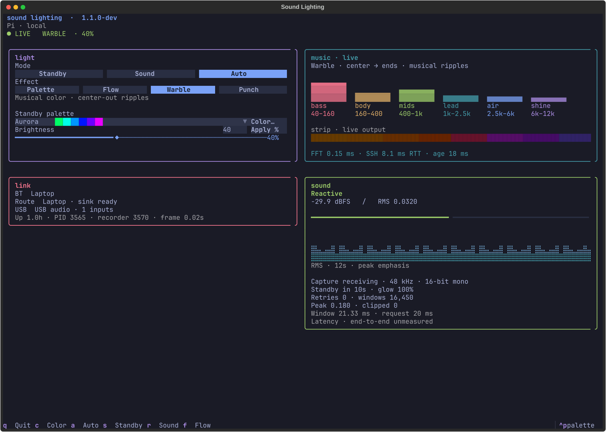
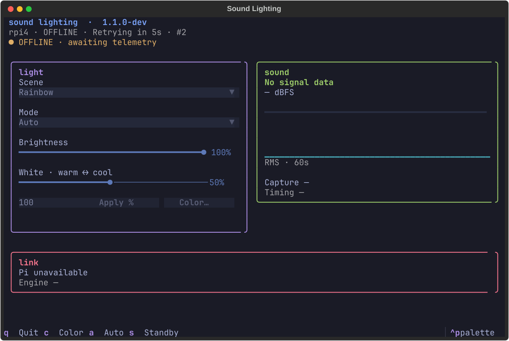
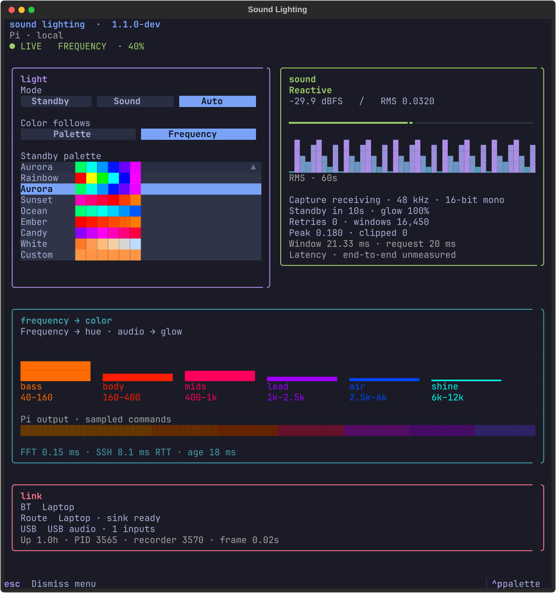
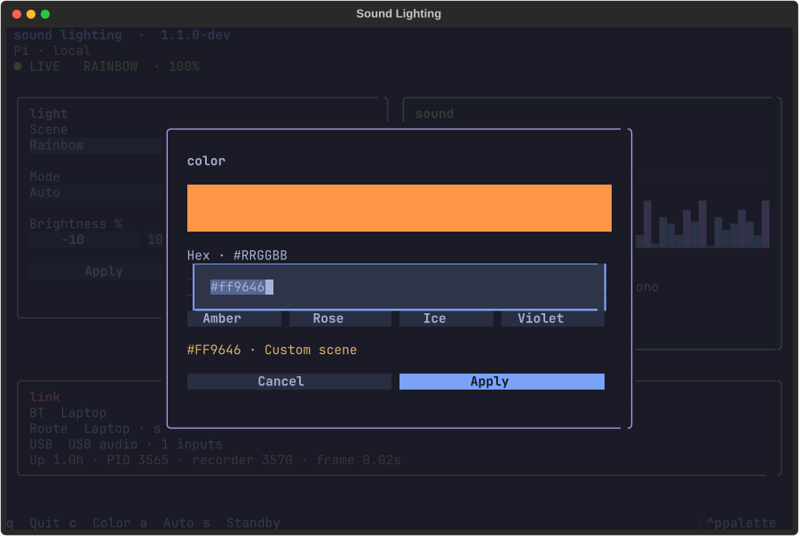

# The room, at a glance

The `TUI` branch adds a terminal remote to the existing light service. One process
still owns GPIO. Opening a dashboard starts no recorder, changing a control needs
no restart, and closing it leaves the lights on.



## Open it

On this Omarchy laptop, **SUPER+SPACE → Sound Lighting**. It opens in your default
terminal with an app icon and the active Omarchy btop palette, including its colored panel borders and graph gradient. Reopen after
changing themes to pick up the new palette. You can also run:

```sh
sound-lighting
```

The interface runs on the laptop. A single SSH connection streams Pi status and
acknowledges settings changes. It uses your existing `rpi4` SSH configuration and
key; it never stores a password. No extra network port is opened.

When the Pi is missing, the window stays open, reports the connection error and
retry countdown, and retries five seconds after each failed attempt. Connection
attempts are bounded. Controls are disabled while disconnected; changes are not
queued for an unexpected later replay. If an acknowledgement is lost, check the
live settings after reconnecting before retrying. Closing the app closes its SSH
agent; the light service and laptop audio helper keep running.



On the Pi: `sudo lights tui` still works after `bash install/install-tui.sh`.
For observation only on the laptop: `sound-lighting --read-only`.
Use a terminal around **100 columns × 52 rows** for the full view. The music pane sits beside the controls. Narrower windows
stack the panels; scroll or Tab to reach the remaining controls. The app tiles,
resizes, and moves between workspaces normally; it no longer forces a floating size.

| Control | What happens |
| --- | --- |
| Mode / S / R / A | Standby keeps the selected palette; Sound stays reactive and dims while quiet; Auto returns to standby after 10 seconds without detected audio. |
| Effect / F | Palette uses your colorway; Flow (F), Warble, and Punch choose musical colors in one click. Warble adds gentle center-out ripples. Punch exposes its intensity slider beside the effect buttons. |
| Palette | Every option shows colored swatches. With a musical effect selected, this is the standby/fallback palette. |
| Brightness | Drag for live updates; Shift-drag is finer. Arrows change 1%, PgUp/PgDn 10%, Home/End reach the limits. Exact entry + Enter or Apply % also works. Zero stays dark, including after reboot. |
| Punch · gentle ↔ vivid | Shown beside Effect → Punch. 0 is gentle, 50 is the balanced tuning, 100 is most vivid; fast attack stays constant. |
| White · warm ↔ cool | Choose Palette → White, then drag or use arrow keys to adjust its tint. 0 is warm, 100 cool; 50 preserves the original Workshop white. |
| Color / C | A separate dialog with a hex field, live swatch, and eight presets. Apply selects Custom. Cancel or Escape changes nothing. |
| Q | Close only the dashboard. |

Musical effects open a dedicated live pane with colored band shares and Hz
ranges, a strip preview, and a short explanation of what controls the output.
The preview samples the Pi’s smoothed RGB commands after master brightness; it
is not a measurement of the physical LEDs. Swatches are approximate. Band
telemetry arrives over SSH at up to 20 Hz; the RGB preview updates at 5 Hz; narrow windows use horizontal
meters. Missing/stale data clears the visualization.

The custom scene uses the existing slow waves and gentle sound response. It holds
the hue you picked; brightness still varies across the span. White (the `workshop` scene in the CLI) is the constant utility-light option in Standby.
Its slider blends RGB tints, not calibrated Kelvin temperatures. The terminal
swatch is an approximation of the LEDs. `sudo lights white 25` also selects White.
The Pi checks saved settings every 100 ms and fades changes smoothly; network
and control acknowledgement can add delay. The top strip shows what
the engine has actually applied. Remote changes refresh the controls while keeping
an unfinished brightness edit intact. Slider drags update live, with one acknowledged write in flight and only the newest
values waiting. Release sends the final value; Escape restores the value from before
the drag. Shift-drag gives fine control; wheel changes a focused slider by 2%
(Shift-wheel 1%), while unfocused sliders let the page scroll. Bigger hit areas,
hover/focus highlighting, and a warm/cool track make controls easier to read. CLI changes appear in live status too.





## Read the room

- **Sound reactive / Quiet / Screensaver:** silence lasting more than 0.25 seconds
  dims to an 8% glow multiplier in about two seconds. After the ten-second quiet
  timeout, standby fades back in. Sound returns automatically at any point.
  Standby bypasses this dim. Sound remains dim while silent instead of entering standby.
- **Signal:** RMS level in dBFS, a −60 to 0 dBFS meter, and a 12-second scrolling
  history sampled five times per second. The graph uses a fixed −54 to −6 dBFS
  scale, 32 bar-height steps, and subtle column ridges. Fast transients between status updates may be missed.
- **Capture:** frames arriving, configured 48 kHz, 16-bit mono, retry count, analyzed
  windows, largest observed sample peak, and windows containing near-clipping samples.
  These counters start over with the engine. Windows are sampled for analysis;
  they are not a packet count or a guarantee of detecting every clipped sample.
- **Timing:** a 1,024-sample analysis window is **21.33 ms** at 48 kHz.
  The **20 ms request** is the recorder’s PipeWire buffer latency setting, not a
  measured transport delay ([PipeWire reference](https://docs.pipewire.org/1.4/page_man_pw-cat_1.html)).
  End-to-end latency explicitly reads **unmeasured**. Bluetooth buffering, a
  30/60 Hz render loop, and intentional smoothing add delay; these components cannot
  simply be summed into an accurate total. Measuring the AUX/light offset requires
  a synchronized loopback or external light/audio recording. Frame age is freshness,
  not latency.
- **Connection:** connected Bluetooth audio peers and the active PipeWire route
  into the lighting sink, checked every five seconds. USB presence is reported
  separately; the dashboard does not route USB audio.
- **Runtime:** engine/recorder PIDs, uptime, and last captured frame age. Missing
  or more than five-second-old status is marked offline/stale. Saved controls can
  still be changed while offline, but take effect only when the engine returns.

An open capture sink can produce silent frames without a connected laptop.
Bluetooth connected, routed audio, and audible signal are separate observations.
End-to-end latency, radio packet loss, and the AUX/Bluetooth timing offset are not
measured. Audio inspection failures appear on the dashboard and retry automatically.

## Install the optional interface

First update the Pi’s `TUI` checkout so `tools/remote_agent.py` is present. The
supported Pi user already has noninteractive sudo for the existing lighting setup.
Verify the existing key-based connection with `ssh -o BatchMode=yes rpi4 true`.
Then, on Omarchy, from the laptop checkout:

```sh
python3 tools/install_omarchy.py --host rpi4
```

The installer creates `~/.local/bin/sound-lighting`,
`~/.local/share/applications/org.omarchy.SoundLighting.desktop`, and an SVG icon
under `~/.local/share/icons/hicolor/scalable/apps/`. Dependencies live in
`~/.local/share/sound-lighting/tui-venv`. The launcher references this checkout;
rerun the installer if you move it. Replaced launcher/icon files are backed up
under `~/.local/state/sound-lighting/install-backup/`. An app-specific rule in
`~/.config/hypr/sound_lighting.lua` uses normal Hyprland tiling; the installer
adds its include to `hyprland.lua`, reloads and validates it, and restores the old
configuration if validation fails. Your terminal configuration remains unchanged.

The Pi-hosted interface is also available:

From a clean checkout on the supported Pi layout:

```sh
cd /home/pi/Sound-Lighting-Project
git fetch origin
git switch TUI
git pull --ff-only
sudo bash install/install.sh
bash install/install-tui.sh
sudo lights tui
```

The core install briefly restarts audio and lighting. The optional installer does
not interrupt either. It pins Textual in
`/home/pi/.local/share/sound-lighting/tui-venv`, runs the dashboard tests, and installs
the `lights tui` launcher. The LED service keeps its existing system Python,
NumPy, and WS2811 library. `python3-venv` is required to create the environment.

The local UI consists of `tools/dashboard.py`, `tools/dashboard.tcss`, and
`tools/dashboard_data.py`, plus the small slider, palette-preview, and spectrum-pane widgets. It imports shared settings validation and reads the
engine's status JSON. PipeWire inspection runs as `pi`, even when the dashboard
runs under sudo, and its short-lived subprocess is reaped on timeout or exit.

## Test without touching the strip

```sh
python3 -m unittest discover -s tests
python3 -m unittest discover -s tests -p test_remote.py
~/.local/share/sound-lighting/tui-venv/bin/python -m unittest discover -s tests -p test_dashboard.py
```

The core suite skips optional UI interactions when Textual is absent; the second
command runs those interactions in a headless terminal against temporary settings.
The suite checks preserved preferences, brightness validation, color save/cancel,
read-only behavior, stale status, connection-versus-route detection, custom hue
rendering, and recorder cleanup/retry. Transport tests cover initial failure,
reconnection, acknowledged writes, no offline replay, and child-process cleanup.

## Return to 1.0

The `color`, `white`, `color_source`, `frequency_style`, and `punch` settings and extra scenes are specific to this branch.
Back up your settings and remove these fields before returning to `master`:

```sh
cd /home/pi/Sound-Lighting-Project
sudo cp /etc/sound-lighting.json /etc/sound-lighting.tui-backup.json
sudo env PYTHONPATH=RpiLightStripCodes python3 - <<'PY'
import json
from pathlib import Path
from settings import atomic_json
path = Path('/etc/sound-lighting.json')
settings = json.loads(path.read_text())
settings.pop('color', None)
settings.pop('white', None)
settings.pop('color_source', None)
settings.pop('frequency_style', None)
settings.pop('punch', None)
if settings.get('behavior') == 'sound':
    settings['behavior'] = 'auto'
if settings.get('scene') not in ('rainbow', 'aurora', 'workshop'):
    settings['scene'] = 'rainbow'
atomic_json(path, settings)
PY
sudo systemctl stop addy-bluetooth.service
git switch master
sudo bash install/install.sh
```

The dashboard environment can remain installed for your next visit to `TUI`.

The warm/cool slider appears when **Palette → White** is selected. Musical effects
keep the standby colorway available without showing unrelated white controls.
The band display updates at up to 20 Hz over SSH, with crisp Braille dots,
90 ms release, and falling peak marks; the sound history retains its 12-second view.

Charts use btop’s installed CPU gradient for sound history and softer theme hues
for the musical bands. Two dot columns per terminal cell preserve fine detail.
Brief UI scheduling gaps are visually interpolated; real silence, disconnection,
and long gaps still clear. Musical meters use 15 ms attack and 90 ms release.

The light panel groups palette/color and brightness/entry controls on shared rows.
Link details sit underneath. Music meters use bold solid fills; the dotted RMS
history uses a fixed −46 to −16 dBFS scale with nonlinear peak emphasis. This is
a visual exaggeration: the RMS number and level meter retain their measured values.
