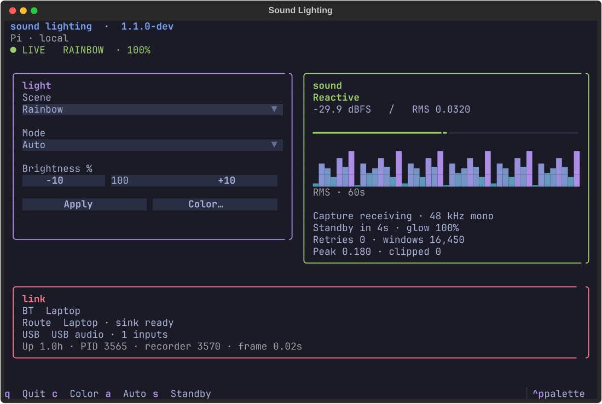

# The room, at a glance

The `TUI` branch adds a terminal remote to the existing light service. One process
still owns GPIO. Opening a dashboard starts no recorder, changing a control needs
no restart, and closing it leaves the lights on.



## Open it

On this Omarchy laptop, **SUPER+SPACE → Sound Lighting**. It opens in your default
terminal with an app icon and the active Omarchy btop palette, including its colored panel borders and graph gradient. Reopen after
changing themes to pick up the new palette. You can also run:

```sh
sound-lighting
```

The interface runs on the laptop. A single SSH connection streams Pi status and
acknowledges settings changes. It uses your existing `rpi4` SSH configuration and
key; it never stores a password. No extra network port is opened.

When the Pi is missing, the window stays open, reports the connection error and
retry countdown, and retries five seconds after each failed attempt. Connection
attempts are bounded. Controls are disabled while disconnected; changes are not
queued for an unexpected later replay. If an acknowledgement is lost, check the
live settings after reconnecting before retrying. Closing the app closes its SSH
agent; the light service and laptop audio helper keep running.


On the Pi: `sudo lights tui` still works after `bash install/install-tui.sh`.
For observation only on the laptop: `sound-lighting --read-only`.
Use a terminal around **100 columns × 32 rows** for the full view. Narrower windows
stack the panels; scroll or Tab to reach the remaining controls. The app tiles,
resizes, and moves between workspaces normally; it no longer forces a floating size.

| Control | What happens |
| --- | --- |
| Scene | Rainbow, Aurora, steady Workshop, or your Custom hue. |
| Behavior / A / S | Auto follows sound; Screensaver keeps the idle animation. Workshop stays steady. |
| Brightness | Enter 0–100 and press Enter or Apply; −10/+10 makes quick adjustments. Zero stays dark, including after reboot. |
| Color / C | A separate dialog with a hex field, live swatch, and four presets. Apply selects Custom. Cancel or Escape changes nothing. |
| Q | Close only the dashboard. |

The custom scene uses the existing slow waves and gentle sound response. It holds
the hue you picked; brightness still varies across the span. Workshop is the
constant utility-light option. The terminal swatch is an approximation of the LEDs.
Saved settings apply within a second and fade smoothly. The top strip shows what
the engine has actually applied. Remote changes refresh the controls while keeping
an unfinished brightness edit intact. CLI changes appear in live status too.


## Read the room

- **Sound reactive / Quiet / Screensaver:** silence lasting more than 0.25 seconds
  dims to an 8% glow multiplier in about two seconds. After the four-second quiet
  timeout, standby fades back in. Sound returns automatically at any point.
  Workshop and forced Screensaver bypass this dim.
- **Signal:** RMS level in dBFS, a −60 to 0 dBFS meter, and 60 seconds of relative
  history sampled once per second. Fast transients between status updates may be missed.
- **Capture:** frames arriving, configured 48 kHz mono, retry count, analyzed
  windows, largest observed sample peak, and windows containing near-clipping samples.
  These counters start over with the engine. Windows are sampled for analysis;
  they are not a packet count or a guarantee of detecting every clipped sample.
- **Connection:** connected Bluetooth audio peers and the active PipeWire route
  into the lighting sink, checked every five seconds. USB presence is reported
  separately; the dashboard does not route USB audio.
- **Runtime:** engine/recorder PIDs, uptime, and last captured frame age. Missing
  or more than five-second-old status is marked offline/stale. Saved controls can
  still be changed while offline, but take effect only when the engine returns.

An open capture sink can produce silent frames without a connected laptop.
Bluetooth connected, routed audio, and audible signal are separate observations.
End-to-end latency, radio packet loss, and the AUX/Bluetooth timing offset are not
measured. Audio inspection failures appear on the dashboard and retry automatically.

## Install the optional interface

First update the Pi’s `TUI` checkout so `tools/remote_agent.py` is present. The
supported Pi user already has noninteractive sudo for the existing lighting setup.
Verify the existing key-based connection with `ssh -o BatchMode=yes rpi4 true`.
Then, on Omarchy, from the laptop checkout:

```sh
python3 tools/install_omarchy.py --host rpi4
```

The installer creates `~/.local/bin/sound-lighting`,
`~/.local/share/applications/org.omarchy.SoundLighting.desktop`, and an SVG icon
under `~/.local/share/icons/hicolor/scalable/apps/`. Dependencies live in
`~/.local/share/sound-lighting/tui-venv`. The launcher references this checkout;
rerun the installer if you move it. Replaced launcher/icon files are backed up
under `~/.local/state/sound-lighting/install-backup/`. An app-specific rule in
`~/.config/hypr/sound_lighting.lua` uses normal Hyprland tiling; the installer
adds its include to `hyprland.lua`, reloads and validates it, and restores the old
configuration if validation fails. Your terminal configuration remains unchanged.

The Pi-hosted interface is also available:

From a clean checkout on the supported Pi layout:

```sh
cd /home/pi/Sound-Lighting-Project
git fetch origin
git switch TUI
git pull --ff-only
sudo bash install/install.sh
bash install/install-tui.sh
sudo lights tui
```

The core install briefly restarts audio and lighting. The optional installer does
not interrupt either. It pins Textual in
`/home/pi/.local/share/sound-lighting/tui-venv`, runs the dashboard tests, and installs
the `lights tui` launcher. The LED service keeps its existing system Python,
NumPy, and WS2811 library. `python3-venv` is required to create the environment.

The local UI consists of `tools/dashboard.py`, `tools/dashboard.tcss`, and
`tools/dashboard_data.py`. It imports shared settings validation and reads the
engine's status JSON. PipeWire inspection runs as `pi`, even when the dashboard
runs under sudo, and its short-lived subprocess is reaped on timeout or exit.

## Test without touching the strip

```sh
python3 -m unittest discover -s tests
python3 -m unittest discover -s tests -p test_remote.py
~/.local/share/sound-lighting/tui-venv/bin/python -m unittest discover -s tests -p test_dashboard.py
```

The core suite skips optional UI interactions when Textual is absent; the second
command runs those interactions in a headless terminal against temporary settings.
The suite checks preserved preferences, brightness validation, color save/cancel,
read-only behavior, stale status, connection-versus-route detection, custom hue
rendering, and recorder cleanup/retry. Transport tests cover initial failure,
reconnection, acknowledged writes, no offline replay, and child-process cleanup.

## Return to 1.0

The new `color` setting and Custom scene are specific to this branch. Back up your
settings and remove that field before returning to `master`:

```sh
cd /home/pi/Sound-Lighting-Project
sudo cp /etc/sound-lighting.json /etc/sound-lighting.tui-backup.json
sudo env PYTHONPATH=RpiLightStripCodes python3 - <<'PY'
import json
from pathlib import Path
from settings import atomic_json
path = Path('/etc/sound-lighting.json')
settings = json.loads(path.read_text())
settings.pop('color', None)
if settings.get('scene') == 'custom':
    settings['scene'] = 'rainbow'
atomic_json(path, settings)
PY
sudo systemctl stop addy-bluetooth.service
git switch master
sudo bash install/install.sh
```

The dashboard environment can remain installed for your next visit to `TUI`.
